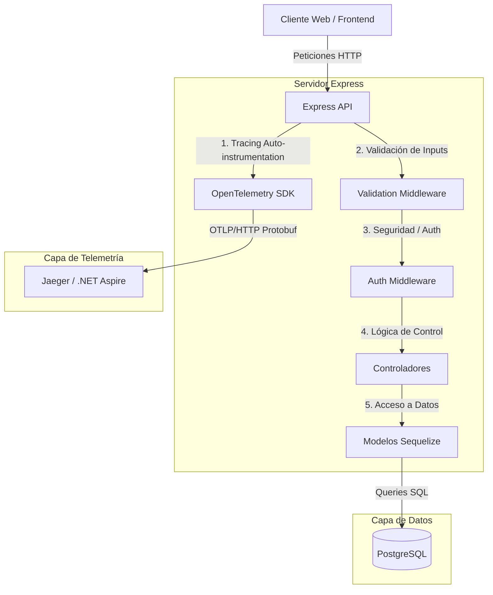
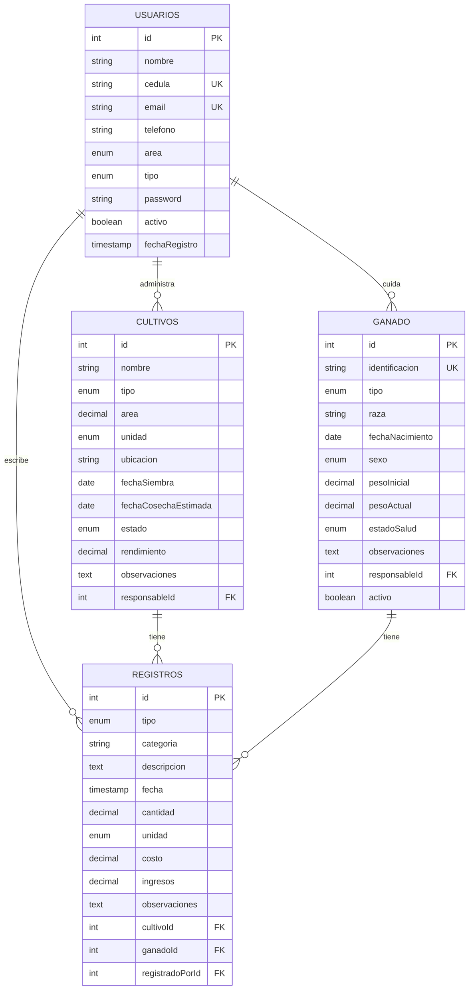

# Manual Técnico - Finca LODANA Backend

## Objetivo

Documentar la arquitectura técnica, los componentes principales, la estrategia de persistencia, la validación de datos y la observabilidad del backend de Finca LODANA.

## Arquitectura

## Componentes del Código

- `routes/`: Define las rutas de entrada HTTP y asocia los middlewares de validación, autenticación y controlador respectivo.
- `controllers/`: Contiene la lógica de negocio y respuesta HTTP. Traduce peticiones HTTP a acciones sobre el modelo.
- `middleware/`: Contiene filtros transversales:
  - `auth.js`: Valida el token JWT en las cookies.
  - `validation.js`: Aplica esquemas estructurados usando `express-validator`.
  - `errorMiddleware.js`: Centraliza el tratamiento de excepciones.
- `models/`: Define las clases del ORM Sequelize que mapean a las tablas de PostgreSQL.
- `config/`: Centraliza archivos de configuración (base de datos, secretos JWT, etc.).
- `scripts/`: Contiene tareas de administración tales como la inicialización de la base de datos (`createDatabase.js`).

---

## Diseño de Base de Datos

El motor de persistencia utilizado es **PostgreSQL**. El ORM **Sequelize** maneja la sincronización de modelos de forma declarativa.

### Entidades y Atributos

#### 1. Tabla `usuarios`
- **id** (INTEGER, PK, Auto-increment): Identificador único del usuario.
- **nombre** (STRING, Obligatorio): Nombre completo.
- **cedula** (STRING, Único, Obligatorio): Cédula nacional de identidad (10 a 20 caracteres).
- **email** (STRING, Único, Obligatorio): Dirección de correo electrónico.
- **telefono** (STRING, Obligatorio): Número de contacto.
- **area** (ENUM, Obligatorio): Área de trabajo (`cultivos`, `ganaderia`, `mantenimiento`, `administracion`, `investigacion`).
- **tipo** (ENUM, Obligatorio): Rol del usuario (`trabajador`, `administrador`).
- **password** (STRING, Obligatorio): Hash de contraseña (encriptado con bcrypt con factor de costo 10).
- **activo** (BOOLEAN, Default: `true`): Habilitado para inicio de sesión (desactivación lógica).
- **fechaRegistro** (TIMESTAMP, Automatic): Fecha de creación del registro.

#### 2. Tabla `cultivos`
- **id** (INTEGER, PK, Auto-increment): Identificador del cultivo.
- **nombre** (STRING, Obligatorio): Nombre común del cultivo (ej. "Maíz Amarillo").
- **tipo** (ENUM, Obligatorio): Clasificación (`vegetal`, `frutal`, `cereal`, `hortaliza`, `leguminosa`, `otro`).
- **area** (DECIMAL, Obligatorio): Extensión del área plantada.
- **unidad** (ENUM, Obligatorio, Default: `hectareas`): Unidad de medida (`metros`, `hectareas`).
- **ubicacion** (STRING, Obligatorio): Lote o geolocalización.
- **fechaSiembra** (DATE, Obligatorio): Fecha de inicio de la siembra.
- **fechaCosechaEstimada** (DATE, Opcional): Proyección de cosecha.
- **estado** (ENUM, Default: `siembra`): Fase actual (`siembra`, `crecimiento`, `floracion`, `cosecha`, `completado`).
- **rendimiento** (DECIMAL, Opcional): Kilos o toneladas resultantes de la cosecha.
- **observaciones** (TEXT, Opcional): Detalles adicionales.
- **responsableId** (INTEGER, FK, Obligatorio): Enlace a `usuarios(id)` (`onDelete: RESTRICT`, `onUpdate: CASCADE`).

#### 3. Tabla `ganado`
- **id** (INTEGER, PK, Auto-increment): Identificador del animal.
- **identificacion** (STRING, Único, Obligatorio): Código de arete u orejera.
- **tipo** (ENUM, Obligatorio): Clasificación del animal (`bovino`, `porcino`, `ovino`, `caprino`, `avicola`, `otro`).
- **raza** (STRING, Obligatorio): Raza (ej. "Holstein").
- **fechaNacimiento** (DATE, Obligatorio): Fecha de nacimiento.
- **sexo** (ENUM, Obligatorio): Sexo (`macho`, `hembra`).
- **pesoInicial** (DECIMAL, Opcional): Peso reportado al ingresar.
- **pesoActual** (DECIMAL, Opcional): Peso actualizado.
- **estadoSalud** (ENUM, Default: `bueno`): Diagnóstico (`excelente`, `bueno`, `regular`, `enfermo`).
- **observaciones** (TEXT, Opcional): Historial médico básico o notas.
- **responsableId** (INTEGER, FK, Obligatorio): Trabajador a cargo, enlace a `usuarios(id)` (`onDelete: RESTRICT`, `onUpdate: CASCADE`).
- **activo** (BOOLEAN, Default: `true`): Estado contable/físico activo en finca.

#### 4. Tabla `registros`
- **id** (INTEGER, PK, Auto-increment): Identificador único del evento financiero u operativo.
- **tipo** (ENUM, Obligatorio): Tipo de actividad (`cultivo`, `ganado`, `mantenimiento`, `produccion`, `venta`, `otro`).
- **categoria** (STRING, Obligatorio): Subtipo (ej. "Vacunación", "Compra Fertilizante").
- **descripcion** (TEXT, Obligatorio): Descripción detallada del evento.
- **fecha** (TIMESTAMP, Default: `NOW`): Fecha del evento.
- **cantidad** (DECIMAL, Opcional): Cantidad física involucrada (ej. litros de leche, kg de abono).
- **unidad** (ENUM, Opcional): Unidad física (`kg`, `toneladas`, `litros`, `unidades`, `metros`, `hectareas`, `otro`).
- **costo** (DECIMAL, Opcional): Costo económico incurrido (egreso).
- **ingresos** (DECIMAL, Opcional): Ganancia monetaria directa (ingreso).
- **observaciones** (TEXT, Opcional): Anotaciones adicionales.
- **cultivoId** (INTEGER, FK, Opcional): Enlace opcional a `cultivos(id)` (`onDelete: SET NULL`).
- **ganadoId** (INTEGER, FK, Opcional): Enlace opcional a `ganado(id)` (`onDelete: SET NULL`).
- **registradoPorId** (INTEGER, FK, Obligatorio): Enlace al usuario creador, `usuarios(id)` (`onDelete: RESTRICT`).

---

## Validación de Entradas (Input Validation)

Todas las rutas que modifican recursos de base de datos están validadas mediante middleware que utiliza la librería `express-validator` para asegurar que las entradas sigan el esquema y evitar inyecciones.

### Estrategia de Validación

1. **Definición de Reglas**: En `middleware/validation.js`, se definen arrays de validadores por entidad utilizando funciones de sanidad como `.trim()`, `.isEmail()`, `.isFloat()`, etc.
2. **Controlador de Errores**: El middleware `validate` ejecuta `validationResult(req)` y, si existen errores, retorna un error de cliente HTTP 400 (`success: false, errors: [...]`) sin invocar al controlador.
3. **Reglas Específicas**:
   - **Registro de Usuarios (`validateUsuario`)**: Contraseñas de mínimo 6 caracteres, confirmación idéntica y formato de cédula y teléfono obligatorios.
   - **Actualización de Usuarios (`validateUsuarioUpdate`)**: Todos los campos son opcionales, pero si se proveen deben cumplir las reglas estructurales (ej. formato de email o celular).
   - **Cambio de Contraseña (`validateChangePassword`)**: Valida que la contraseña actual esté presente y la nueva cumpla con la longitud requerida.
   - **Fechas de Cultivo**: Comprueba que la fecha de siembra no sea absurda en el futuro y que la fecha de cosecha estimada sea posterior a la de siembra.

---

## Observabilidad y Telemetría con OpenTelemetry

El backend cuenta con trazabilidad distribuida e instrumentación automática mediante **OpenTelemetry (OTel)**.

### Flujo de Telemetría

1. **Arranque Precoz**: El script `otel.js` se importa antes de cualquier otra dependencia en `server.js` (`require('./otel')`) para garantizar el parcheado de módulos (`http`, `express`, `pg`).
2. **Auto-instrumentación**: Utiliza `@opentelemetry/auto-instrumentations-node` para crear automáticamente spans sobre llamadas HTTP entrantes (Express), salientes (HTTP client) y queries a la base de datos (PostgreSQL/Sequelize).
3. **Exportación de Datos**: Las trazas recopiladas se formatean y exportan mediante el protocolo binario **OTLP over HTTP** (`@opentelemetry/exporter-trace-otlp-proto`).

### Variables de Entorno Clave

- `OTEL_SERVICE_NAME`: Define el nombre identificador del servicio (Default: `finca-lodana-backend`).
- `OTEL_EXPORTER_OTLP_ENDPOINT`: Especifica la dirección física del recolector (ej. `.NET Aspire Dashboard` o un colector Jaeger corriendo en local).
  - Si no está definida la variable de entorno, el SDK de OpenTelemetry realiza un fallback automático enviando telemetría a un recolector HTTP en `http://localhost:4318/v1/traces`.

### Visualización en Desarrollo

1. **Docker Compose Standalone**: Hemos integrado **Jaeger** en `docker-compose.yml`. Al ejecutar `docker compose up`, se levanta Jaeger junto con la base de datos.
   - Las trazas se envían directamente a Jaeger en el puerto `4318`.
   - Puedes abrir la UI de visualización de trazas en `http://localhost:16686`.
2. **Orquestación con .NET Aspire**: Al ejecutar el proyecto usando .NET Aspire, las variables `OTEL_EXPORTER_OTLP_ENDPOINT` y demás tokens de autenticación se inyectan automáticamente en el backend Node.js. El dashboard centralizado de Aspire recopila e ilustra todas las peticiones, errores y llamadas a la base de datos.
