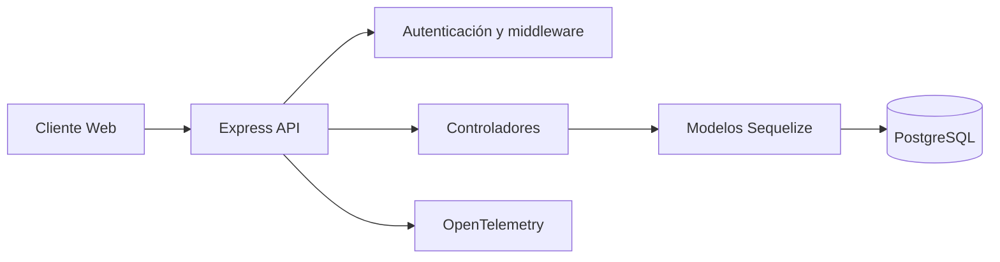

# Manual Técnico - Finca LODANA Backend

## Objetivo

Documentar la arquitectura técnica, los componentes principales y la estrategia de despliegue del backend de Finca LODANA.

## Arquitectura

## Componentes

- `routes/`: define los puntos de entrada HTTP.
- `controllers/`: traduce peticiones HTTP a operaciones de dominio y persistencia.
- `middleware/`: maneja autenticación, validación y errores.
- `models/`: define entidades Sequelize y sus relaciones.
- `config/`: centraliza conexión a base de datos y utilidades compartidas.
- `scripts/`: tareas operativas como la creación inicial de la base de datos.

## Entidades

- `Usuario`: credenciales, rol y datos de contacto.
- `Cultivo`: información operativa de parcelas y ciclos productivos.
- `Ganado`: inventario y seguimiento de animales.
- `Registro`: bitácora transversal vinculada a usuario, cultivo o ganado.

## Despliegue Local

1. Levantar PostgreSQL y el backend con `docker compose up --build`.
2. Proveer `JWT_SECRET` y credenciales de base de datos mediante variables de entorno.
3. Ejecutar migraciones o la inicialización de tablas antes de exponer el servicio.

## CI/CD

El workflow de GitHub Actions ejecuta instalación de dependencias, pruebas y auditoría de seguridad. La validación ocurre contra una instancia temporal de PostgreSQL para evitar dependencias locales.

## Observabilidad

El backend intenta inicializar OpenTelemetry al arranque. Si los paquetes no están instalados, la aplicación continúa sin telemetría para no bloquear entornos de desarrollo.